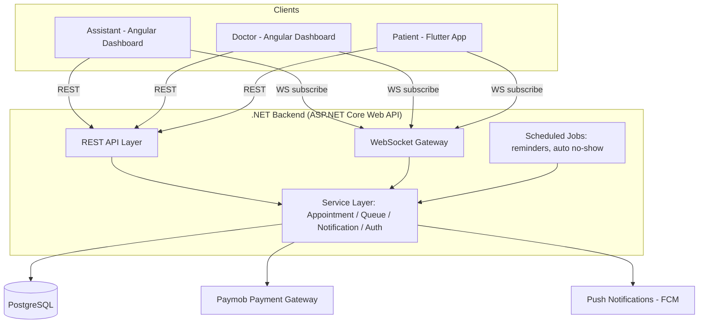

# 🏥 Smart Clinic Queue & Appointment System

> A queue and appointment management system for small and medium clinics — reducing patient waiting time through real-time queue tracking and smart notifications.

[]()
[]()

---

## 📖 About

Patients waste hours sitting inside clinics with no visibility into how long they'll wait. **Smart Clinic Queue & Appointment System** solves this by giving clinics a real-time queue engine and giving patients live visibility into their position and estimated wait time — all without needing to be physically present in the waiting room.

**MVP focus:** appointment scheduling + live queue management + notifications, for a single clinic.

---

## ✨ Features

### 📅 Appointment Management
- Create, edit, cancel, and reschedule appointments *(managed by Assistant — patients don't self-book in v1)*
- Patient attendance confirmation
- Automatic no-show detection

### 🔄 Real-Time Queue Management
- Live queue with current & next patient
- Automatic position recalculation as patients move through
- Skip delayed patients + rejoin queue flow
- Estimated wait time per patient

### 🔔 Smart Notifications
- Reminder 30 minutes before appointment
- "2 patients remaining" alert
- "You're next" alert
- Skipped / cancelled appointment alerts
- Missed appointment → rebook prompt

### 📊 Dashboards
- **Assistant Dashboard** — today's schedule, live queue, patient search, check-in
- **Doctor Dashboard** — current patient, next patient, queue overview, start/complete consultation
- **Patient App** — appointment details, live queue position, estimated wait time, notifications

---

## 🧑‍🤝‍🧑 Users & Roles

| Role | Client | Responsibilities |
|---|---|---|
| **Assistant** | Angular Dashboard | Create/cancel/reschedule appointments, check-in, skip delayed patients, manage daily schedule |
| **Doctor** | Angular Dashboard | Start/complete consultations, view live queue |
| **Patient** | Flutter Mobile App | View appointment, confirm attendance, track queue, receive notifications, rebook if missed |

---

## 🏗️ Tech Stack

| Layer | Technology |
|---|---|
| **Backend** | .NET (ASP.NET Core Web API) |
| **Database** | PostgreSQL |
| **Frontend (Dashboards)** | Angular |
| **Mobile App (Patient)** | Flutter |
| **Realtime** | WebSockets |
| **Payments** | Paymob |
| **Push Notifications** | Firebase Cloud Messaging (FCM) — delivery channel only |

---

## 🏛️ Architecture



Single PostgreSQL schema, multi-clinic-ready via `clinic_id` foreign keys. REST handles CRUD; WebSockets push live queue/status updates; scheduled jobs handle time-based triggers (reminders, no-show detection).

---

## 🔄 Core Appointment Flow

```
BOOKED → CHECKED_IN → WAITING → IN_PROGRESS → COMPLETED
```

Alternate paths: `BOOKED → CANCELLED`, `BOOKED → NO_SHOW`, `WAITING → SKIPPED → WAITING (rejoin)`

Full step-by-step workflow (actors, triggers, API calls, notifications) is documented in [`clinic-system-documentation.md`](./clinic-system-documentation.md) (English) / [`clinic-system-documentation-ar.md`](./clinic-system-documentation-ar.md) (Arabic).

---

## 📁 Project Structure

> Placeholder — will be finalized once the repo is scaffolded.

```
smart-clinic-system/
├── backend/              # ASP.NET Core Web API (.NET)
├── docs/                 # Technical documentation
├── mobile/          # Flutter app (Patient)
├── web/        # Angular app (Assistant + Doctor)
└── README.md
```

---

## 🚀 Getting Started

> Setup instructions will be added once the backend and frontend projects are scaffolded.

```bash
# Backend
cd backend
dotnet restore
dotnet run

# Dashboard (Angular)
cd dashboard-web
npm install
ng serve

# Patient App (Flutter)
cd patient-app
flutter pub get
flutter run
```

---

## 🗺️ Roadmap

**v1 (MVP):** Appointment scheduling · Queue management · Notifications · Assistant/Doctor dashboards · Patient app

**Future:**
- QR Check-in
- WhatsApp Notifications
- Online self-booking
- Multiple Doctors per clinic
- Multiple Clinics
- Medical Records
- Digital Prescriptions
- Reports & Analytics

---

## 📄 Documentation

Detailed technical documentation (architecture, full workflow, status lifecycle, notification triggers, open decisions) lives in:
- [`clinic-system-documentation.md`](./docs/clinic-system-documentation.md) — English
- [`clinic-system-documentation-ar.md`](./docs/clinic-system-documentation-AR.md) — Arabic

---

## 📌 Status

This project is in the **planning / architecture phase**. Database schema and API contracts are being finalized.

---

## 📝 License

_TBD_