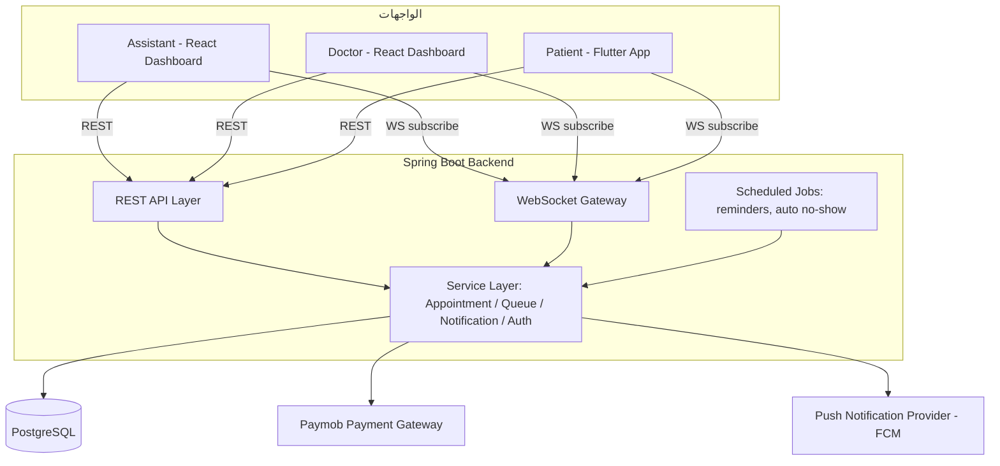
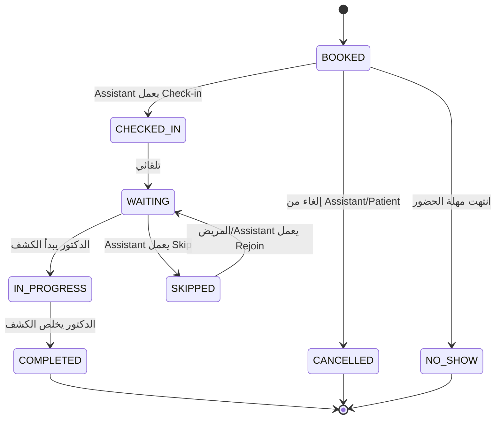

# نظام إدارة الطابور والمواعيد للعيادات — التوثيق الفني
 
**النسخة:** 0.1 (مسودة — بنبنيها تدريجيًا)
**الـ Stack:** PostgreSQL · Spring Boot (Java) · React (لوحات الـ Assistant والـ Doctor) · Flutter (تطبيق المريض) · WebSockets (Realtime) · Paymob (الدفع)
 
---
 
## 1. نظرة عامة على النظام
 
نظام لإدارة الطابور والمواعيد للعيادات الصغيرة والمتوسطة. 3 أطراف بيتعاملوا مع backend واحد:
 
| الطرف | الواجهة | مسؤوليته الأساسية |
|---|---|---|
| Assistant | React Web Dashboard | مسؤول عن دورة حياة الموعد (Appointment) والـ Check-in |
| Doctor | React Web Dashboard | مسؤول عن دورة حياة الكشف (Consultation) |
| Patient | Flutter Mobile App | يشوف موعده، يتابع الطابور، ويستقبل الإشعارات |
 
> **ملاحظة عن الـ MVP Scope:** حسب مواصفات المنتج، المريض **مش بيحجز أونلاين بنفسه** في النسخة الأولى — الـ Assistant هو اللي بيعمل كل الحجوزات. المريض بس بيشوف موعده، يأكد الحضور، ويستقبل الإشعارات. الحجز الذاتي أونلاين ده فيتشر للنسخة الثانية.
 
---
 
## 2. الـ Architecture
 

 
### مسؤوليات كل جزء
 
- **REST API Layer** — عمليات CRUD للمواعيد، المرضى، الأطباء، العيادات، وendpoints الـ Authentication.
- **WebSocket Gateway** — بيبعت حالة الطابور اللحظية، إشعارات "دورك جاي"، وتغييرات الحالة للأطراف المشتركة (channel لكل عيادة).
- **Service Layer** — منطق العمل: تغييرات الحالة (state transitions)، ترتيب الطابور، إطلاق الإشعارات.
- **Scheduled Jobs** — jobs مجدولة (زي cron) للتذكير بـ 30 دقيقة قبل الموعد، وتحديد الـ No-Show تلقائيًا بعد فترة سماح.
- **PostgreSQL** — مصدر الحقيقة الوحيد. schema واحد، ومتعدد العيادات عن طريق `clinic_id` كـ foreign key (بيجهز البنية لفيتشر "Multiple Clinics" المستقبلي).
- **Paymob** — بيتعامل مع دفع رسوم الكشف (لو/لما العيادة تحصّل أونلاين — هنأكد النطاق ده لما نوصل لفيتشر الدفع).
- **FCM (Firebase Cloud Messaging)** — بيُستخدم **بس** لتوصيل الإشعارات (push) لتطبيق الـ Flutter، مش للـ realtime sync للبيانات (ده شغل الـ WebSockets). يعني ده قناة توصيل بس، مش اعتمادية على قاعدة بيانات تانية.
---
 
## 3. أدوار المستخدمين والـ Authentication
 
### الأدوار
| الدور | طريقة الدخول | الواجهة |
|---|---|---|
| `ASSISTANT` | إيميل + باسورد | React Dashboard |
| `DOCTOR` | إيميل + باسورد | React Dashboard |
| `PATIENT` | رقم موبايل + OTP | Flutter App |
 
### الـ Auth Flow
 
**الموظفين (Assistant/Doctor):**
1. POST `/auth/login` بالإيميل والباسورد.
2. الـ Backend بيتحقق من البيانات مقابل جدول `staff_users` (الباسورد مشفر بـ BCrypt).
3. الـ Backend بيصدر JWT access token (عمره قصير، مثلًا 15 دقيقة) + refresh token (عمره أطول، مثلًا 7 أيام).
4. الـ Client بيخزن التوكنز، وبيبعتهم في `Authorization: Bearer <token>` مع كل request.
5. الدور (`ASSISTANT` / `DOCTOR`) متضمن جوه الـ JWT claims — بيُستخدم للتحكم في صلاحيات الـ endpoints (`@PreAuthorize`).
**المريض (Flutter):**
1. المريض بيدخل رقم موبايله → POST `/auth/otp/request`.
2. الـ Backend بيولّد OTP، يبعته عن طريق SMS provider، ويخزّن نسخة مشفرة منه + وقت انتهاء الصلاحية في جدول `otp_requests`.
3. المريض بيدخل الـ OTP → POST `/auth/otp/verify`.
4. لو صح، الـ Backend يا إما يلاقي المريض موجود بالفعل برقم الموبايل، يا إما يعمله سجل جديد، وبعدين يصدر JWT.
5. الـ JWT بتاع المريض محصور على بياناته هو بس (claim اسمه `patient_id` بيتفرض على كل endpoint).
**ليه OTP للمريض وباسورد للموظف؟** الموظفين محتاجين credentials ثابتة يستخدموها يوميًا على الديسكتوب. المريض محتاج طريقة دخول سريعة وسهلة على الموبايل — من غير ما ينسى باسورد، ورقم موبايله أصلًا هو نفسه قناة الإشعارات.
 
---
 
## 4. الـ Workflow الكامل: من الـ Auth لحد انتهاء الكشف
 
الجزء ده بيمشي على **الـ happy path بالكامل** بالترتيب، وبيحدد بالظبط مين بيعمل إيه، النظام بيرد إزاي، الحالة بتتغير إزاي، وأي إشعار بيتبعت.
 
### الخطوة 0 — الـ Authentication
موضحة في القسم 3. كل طرف لازم يكون معاه JWT صالح قبل أي خطوة تحت.
 
---
 
### الخطوة 1 — إنشاء الموعد (Appointment Creation)
**الطرف المسؤول:** Assistant
**السبب:** الـ Assistant بيعمل حجز (مكالمة، حضور شخصي، إلخ)
 
1. الـ Assistant بيدور على المريض/يختاره لو موجود، أو يعمله سجل جديد (اسم، رقم موبايل، الرقم القومي اختياري).
2. الـ Assistant بيختار الدكتور، التاريخ، والـ time slot.
3. `POST /appointments` → الـ backend بيتأكد إن الـ slot ده مش محجوز مرتين لنفس الدكتور.
4. بيتعمل appointment record بحالة **`BOOKED`**.
5. النظام بيجدول job مستقبلي مرتبط بالموعد ده: تذكير الـ 30 دقيقة، وكمان (اختياري) job للتحقق من الـ No-Show.
**الإشعار:** مفيش إشعار دلوقتي (التذكير متجدول لوقت لاحق، مش بيتبعت فورًا — لو عايز نضيف إشعار فوري "تم الحجز" كمان، نقدر نضيفه).
 
---
 
### الخطوة 2 — تذكير قبل الزيارة (Pre-Visit Reminder)
**الطرف المسؤول:** النظام (Scheduled Job)
**السبب:** قبل `appointment.scheduled_time` بـ 30 دقيقة
 
1. الـ job المجدول بيدور على المواعيد اللي حالتها `BOOKED` وباقيلها 30 دقيقة.
2. بيتبعت push notification للمريض: *"موعدك مع د. X بعد 30 دقيقة."*
3. المريض ممكن يدوس **تأكيد الحضور** في التطبيق → `PATCH /appointments/{id}/confirm` → الحالة تفضل `BOOKED` لكن بيتسجل timestamp اسمه `confirmed_at` (يُستخدم للتحليلات / التنبؤ بالـ No-Show لاحقًا، مش بيأثر على أي حاجة في الـ MVP).
---
 
### الخطوة 3 — وصول المريض → الـ Check-In
**الطرف المسؤول:** Assistant
**السبب:** المريض وصل فعليًا للعيادة
 
1. الـ Assistant بيلاقي موعد المريض في جدول اليوم (بحث في الـ dashboard).
2. الـ Assistant بيدوس **Check In** → `PATCH /appointments/{id}/check-in`.
3. الحالة بتتغير **`BOOKED` → `CHECKED_IN`**، وبعدها فورًا → **`WAITING`** (المريض دلوقتي رسميًا في طابور الدكتور).
4. الـ Backend بيحسب مكان المريض في الطابور (بناءً على ترتيب الـ check-in + الطابور الحالي للدكتور) وبيبعت الحالة الجديدة عبر WebSocket لـ: dashboard الـ Assistant، dashboard الـ Doctor، وتطبيق المريض ده تحديدًا.
**الإشعار:** مفيش إشعار push دلوقتي — حالة "أنت في الطابور" ظاهرة في التطبيق فورًا عن طريق WebSocket، مش محتاجة push.
 
---
 
### الخطوة 4 — الانتظار في الطابور
**الطرف المسؤول:** النظام (realtime) + المريض (متابع)
**السبب:** مكان المريض في الطابور بيتغير كل ما حد قدامه يتحرك
 
1. كل مرة مريض قدامه يتحول لـ `IN_PROGRESS` أو `COMPLETED`، الـ backend بيعيد حساب أماكن كل اللي وراه وبيبعت التحديث عبر WebSocket.
2. تطبيق المريض بيعرض مكانه في الطابور لحظيًا + الوقت التقريبي للانتظار (متوسط وقت الكشف × عدد اللي قدامه — moving average بسيط لكل دكتور، هنطوره لاحقًا).
3. **الإشعارات المتفعّلة:**
   - لما المريض يوصل للمركز رقم **3** → push: *"باقي مريضين قبلك."*
   - لما المريض يوصل للمركز رقم **1** → push: *"جاي دورك!"*
---
 
### الخطوة 5 — الدكتور يبدأ الكشف
**الطرف المسؤول:** Doctor
**السبب:** الدكتور جاهز يشوف المريض الحالي
 
1. dashboard الدكتور بيعرض "المريض الحالي" (أول واحد في الطابور) و"المريض التالي" (تاني واحد).
2. الدكتور بيدوس **Start Consultation** → `PATCH /appointments/{id}/start`.
3. الحالة بتتغير **`WAITING` → `IN_PROGRESS`**.
4. الـ Backend بيبعت: المريض ده دلوقتي `IN_PROGRESS`، الطابور بيتحرك خطوة لقدام لكل الباقيين، وإشعار "جاي دورك" بيتفعل للمريض اللي بقى رقم واحد.
---
 
### الخطوة 6 — الدكتور يخلّص الكشف
**الطرف المسؤول:** Doctor
**السبب:** الكشف خلص
 
1. الدكتور بيدوس **Complete** → `PATCH /appointments/{id}/complete`.
2. الحالة بتتغير **`IN_PROGRESS` → `COMPLETED`**.
3. بيتسجل `completed_at` timestamp — ده بيبقى data point لحساب متوسط وقت الكشف عند الدكتور ده (يُستخدم في تقدير وقت الانتظار في الخطوة 4).
4. الطابور بيتحسب تاني للباقيين.
**هنا بينتهي الـ happy path.** دورة حياة الموعد اتقفلت.
 
---
 
## 5. المسارات البديلة (غير الـ Happy Path)
 
| المسار | الطرف المسؤول | السبب | النتيجة |
|---|---|---|---|
| **إلغاء (Cancel)** | Assistant أو Patient | قبل الـ check-in | الحالة → `CANCELLED`. لو الإلغاء من الـ Assistant، بيتبعت إشعار للمريض. |
| **إعادة جدولة (Reschedule)** | Assistant | قبل الـ check-in | الموعد الأصلي → `CANCELLED` (أو حالة اسمها `RESCHEDULED`، هنحددها)، وموعد جديد بيتعمل ومربوط بالأصلي عن طريق `rescheduled_from_id`. |
| **تخطي مريض متأخر (Skip)** | Assistant | المريض عمل check-in لكن مش موجود لما يجيله دوره | الحالة `WAITING` → `SKIPPED`. إشعار: *"تم تخطي موعدك."* المريض يقدر يدوس **Rejoin Queue** في التطبيق. |
| **الرجوع للطابور (Rejoin)** | Patient (من التطبيق) أو Assistant | بعد ما يتم تخطيه | الحالة `SKIPPED` → `WAITING`، المريض بيترجع للطابور **آخره** مش في مكانه الأصلي (قاعدة عمل محتاجة تأكيد منك). |
| **عدم الحضور (No Show)** | النظام (تلقائي) أو Assistant (يدوي) | المريض معملش check-in خالص لحد وقت معين بعد الموعد | الحالة `BOOKED` → `NO_SHOW`. إشعار: *"فاتك موعدك."* → CTA لإعادة الحجز. |
 
---
 
## 6. دورة حياة الحالة (Status Lifecycle)
 

 
---
 
## 7. مرجع الإشعارات
 
| الحدث | المستقبِل | القناة | مثال للرسالة |
|---|---|---|---|
| قبل الموعد بـ 30 دقيقة | Patient | Push | "موعدك مع د. X بعد 30 دقيقة." |
| مكانه في الطابور = 3 | Patient | Push | "باقي مريضين قبلك." |
| مكانه في الطابور = 1 | Patient | Push | "جاي دورك!" |
| تم تخطي الموعد | Patient | Push | "تم تخطي موعدك. دوس عشان ترجع للطابور." |
| تم إلغاء الموعد | Patient | Push | "تم إلغاء موعدك." |
| اتسجل No-Show | Patient | Push | "فاتك موعدك. عايز تحجز تاني؟" |
 
---
 
## 8. أسئلة مفتوحة محتاجة قرار منك
 
الحاجات دي محتاجة إجابتك قبل ما نقفل الـ schema والـ API contracts بشكل نهائي:
 
1. **مكان المريض بعد Rejoin** — لو المريض اتخطى وبعدين رجع، يروح آخر الطابور خالص، ولا ياخد أولوية أعلى شوية (مثلًا يرجع +2 أماكن بدل ما يروح آخر واحد)؟
2. **توقيت الدفع** — رسوم الكشف بتتدفع عن طريق Paymob *قبل الزيارة أونلاين* (دفع مسبق)، ولا *في العيادة* (كاش/كارت شخصيًا، وPaymob بس للتسجيل)؟ ده هيغير هل الخطوة 1 محتاجة sub-step للدفع ولا لأ.
3. **مهلة الـ No-Show** — كام دقيقة بعد الموعد المحدد (من غير check-in) قبل ما نعتبره تلقائيًا `NO_SHOW`؟
4. **عيادات فيها أكتر من دكتور في v1** — الملف الأصلي حاطط "Multiple Doctors" كـ فيتشر مستقبلي، لكن الـ schema فوق أصلًا بتفترض إن كل appointment مربوط بدكتور واحد محدد. أكد لي: v1 عيادة بدكتور واحد بس، ولا ممكن أكتر من دكتور بس في عيادة واحدة؟
---
 
*ده مستند حي — الأقسام الجاية اللي هنضيفها: الـ Database Schema (ERD)، الـ API Contract الكامل (endpoints/request/response)، الـ WebSocket Event Contract، وصفحات تفصيلية لكل فيتشر، هنبنيهم تدريجيًا كل ما نتفق على جزء.*
