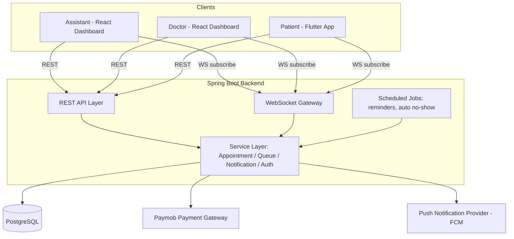
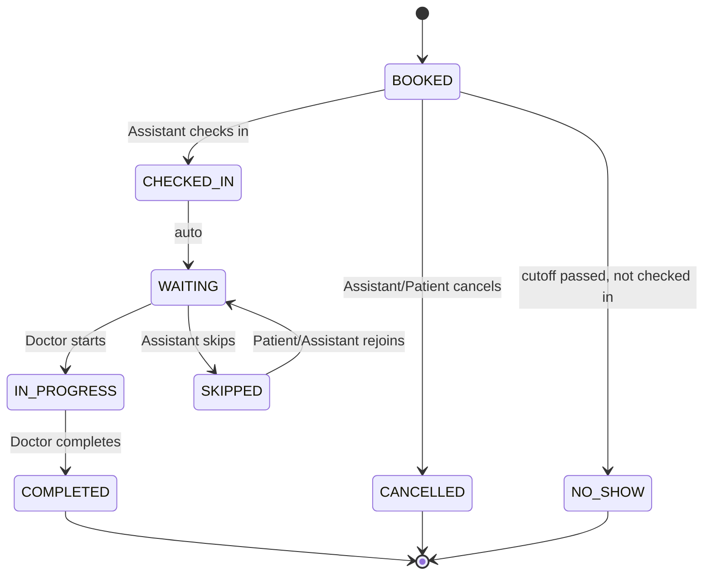

# Smart Clinic Queue & Appointment System — Technical Documentation

**Version:** 0.1 (Draft — building incrementally)
**Stack:** PostgreSQL · Spring Boot (Java) · React (Assistant/Doctor Dashboards) · Flutter (Patient App) · WebSockets (Realtime) · Paymob (Payments)

---

## 1. System Overview

A queue and appointment management system for small/medium clinics. Three actors interact with one backend:

| Actor | Client | Primary Job |
|---|---|---|
| Assistant | React Web Dashboard | Owns appointment lifecycle & check-in |
| Doctor | React Web Dashboard | Owns consultation lifecycle |
| Patient | Flutter Mobile App | Views appointment, tracks queue, gets notified |

> **MVP Scope Note:** Per the product spec, patients do **not** self-book online in v1 — the Assistant creates all appointments. Patients can view, confirm attendance, and receive notifications. Online self-booking is a v2 feature.

---

## 2. Architecture

### Component Responsibilities

- **REST API Layer** — CRUD for appointments, patients, doctors, clinics; auth endpoints.
- **WebSocket Gateway** — pushes live queue state, "you're next" events, status changes to subscribed clients (per-clinic channel).
- **Service Layer** — business rules: state transitions, queue ordering, notification triggers.
- **Scheduled Jobs** — cron-style jobs for "30-min-before" reminders and auto-flagging no-shows after a grace period.
- **PostgreSQL** — single source of truth. One schema, multi-clinic via `clinic_id` foreign keys (future-proofs the "Multiple Clinics" idea).
- **Paymob** — handles consultation fee payment (if/when clinic charges online — confirm scope when we reach the Payment feature).
- **FCM (Firebase Cloud Messaging)** — used *only* for push notification delivery to the Flutter app, not for data/realtime sync (that's WebSockets). This is a delivery channel, not a database dependency.

---

## 3. User Roles & Authentication

### Roles
| Role | Login Method | Client |
|---|---|---|
| `ASSISTANT` | Email + Password | React Dashboard |
| `DOCTOR` | Email + Password | React Dashboard |
| `PATIENT` | Phone Number + OTP | Flutter App |

### Auth Flow

**Staff (Assistant/Doctor):**
1. POST `/auth/login` with email + password.
2. Backend validates credentials against `staff_users` table (password hashed with BCrypt).
3. Backend issues a JWT access token (short-lived, e.g. 15 min) + refresh token (long-lived, e.g. 7 days).
4. Client stores tokens, attaches `Authorization: Bearer <token>` to all subsequent requests.
5. Role (`ASSISTANT` / `DOCTOR`) embedded in JWT claims — used for endpoint authorization (`@PreAuthorize`).

**Patient (Flutter):**
1. Patient enters phone number → POST `/auth/otp/request`.
2. Backend generates OTP, sends via SMS provider, stores hashed OTP + expiry in `otp_requests` table.
3. Patient enters OTP → POST `/auth/otp/verify`.
4. On success, backend either finds existing `patients` record by phone or creates one, then issues JWT.
5. Patient JWT is scoped only to that patient's own data (`patient_id` claim enforced on every endpoint).

**Why OTP for patients but password for staff?** Staff need durable, reusable credentials for daily desktop use. Patients need a low-friction one-time entry point on mobile — no password to forget, and phone number doubles as the notification channel.

---

## 4. End-to-End Workflow: Auth → Completed Consultation

This section walks the **entire happy path** in order, naming exactly who does what, what the system does in response, what status changes, and what notification fires.

### Step 0 — Authentication
Covered in Section 3. All actors must hold a valid JWT before any action below.

---

### Step 1 — Appointment Creation
**Actor:** Assistant
**Trigger:** Assistant creates a booking (walk-in call, in-person request, etc.)

1. Assistant searches/selects patient (existing) or creates a new patient record (name, phone, national ID optional).
2. Assistant selects doctor, date, time slot.
3. `POST /appointments` → backend validates slot isn't double-booked for that doctor.
4. Appointment row created with status **`BOOKED`**.
5. System schedules two future jobs tied to this appointment: the 30-minute reminder job and (optionally) an auto-no-show check.

**Notification fired:** none yet (reminder is scheduled for later, not sent now — configurable if you want an instant "appointment booked" confirmation too, we can add it).

---

### Step 2 — Pre-Visit Reminder
**Actor:** System (scheduled job)
**Trigger:** 30 minutes before `appointment.scheduled_time`

1. Scheduled job queries appointments with status `BOOKED` whose time is 30 min out.
2. Push notification sent to patient: *"Your appointment with Dr. X is in 30 minutes."*
3. Patient can tap **Confirm Attendance** in-app → `PATCH /appointments/{id}/confirm` → status stays `BOOKED` but `confirmed_at` timestamp is set (used for analytics / no-show prediction later, doesn't block anything in MVP).

---

### Step 3 — Patient Arrives → Check-In
**Actor:** Assistant
**Trigger:** Patient physically arrives at the clinic

1. Assistant finds the patient's appointment on today's schedule (dashboard search).
2. Assistant clicks **Check In** → `PATCH /appointments/{id}/check-in`.
3. Status changes **`BOOKED` → `CHECKED_IN`**, then immediately → **`WAITING`** (patient is now formally added to the doctor's live queue).
4. Backend computes the patient's queue position (based on check-in order + doctor's current queue) and broadcasts updated queue state over WebSocket to: Assistant dashboard, Doctor dashboard, and that Patient's app.

**Notification fired:** none yet — the "you're in the queue" state is visible in-app instantly via WebSocket, no push needed.

---

### Step 4 — Waiting in Queue
**Actor:** System (realtime) + Patient (passive)
**Trigger:** Queue position changes as other patients move through

1. Every time a patient ahead in the queue moves to `IN_PROGRESS` or `COMPLETED`, backend recalculates positions for everyone behind and broadcasts via WebSocket.
2. Patient app shows live position + estimated wait time (avg. consultation time × patients ahead — simple moving average per doctor, refine later).
3. **Trigger notifications:**
   - When patient reaches position **3** → push: *"2 patients remaining before you."*
   - When patient reaches position **1** → push: *"You're next!"*

---

### Step 5 — Doctor Starts Consultation
**Actor:** Doctor
**Trigger:** Doctor is ready to see the current patient

1. Doctor dashboard shows "Current Patient" (top of queue) and "Next Patient" (second in line).
2. Doctor clicks **Start Consultation** → `PATCH /appointments/{id}/start`.
3. Status changes **`WAITING` → `IN_PROGRESS`**.
4. Backend broadcasts: this patient is now `IN_PROGRESS`, queue shifts up by one for everyone else, "you're next" notification fires to the new position-1 patient.

---

### Step 6 — Doctor Completes Consultation
**Actor:** Doctor
**Trigger:** Consultation is finished

1. Doctor clicks **Complete** → `PATCH /appointments/{id}/complete`.
2. Status changes **`IN_PROGRESS` → `COMPLETED`**.
3. `completed_at` timestamp saved — this becomes a data point for the doctor's average consultation duration (used in wait-time estimates for Step 4).
4. Queue recalculates for remaining patients.

**This is the end of the happy path.** Appointment lifecycle closed.

---

## 5. Alternate Flows (Non-Happy-Path)

| Flow | Actor | Trigger | Result |
|---|---|---|---|
| **Cancel** | Assistant or Patient | Before check-in | Status → `CANCELLED`. Notification sent to patient if cancelled by Assistant. |
| **Reschedule** | Assistant | Before check-in | Original appointment → `CANCELLED` (or `RESCHEDULED` status, TBD), new appointment created linked to original via `rescheduled_from_id`. |
| **Skip Delayed Patient** | Assistant | Patient checked in but not present when called | Status `WAITING` → `SKIPPED`. Notification: *"Your appointment was skipped."* Patient can tap **Rejoin Queue** in-app. |
| **Rejoin Queue** | Patient (via app) or Assistant | After being skipped | Status `SKIPPED` → `WAITING`, patient re-added to queue — **at the back**, not their original position (business rule to confirm with you). |
| **No Show** | System (auto) or Assistant (manual) | Patient never checks in by a cutoff time after scheduled slot | Status `BOOKED` → `NO_SHOW`. Notification: *"You missed your appointment."* → **Rebook** CTA sent. |

---

## 6. Status Lifecycle Diagram

---

## 7. Notification Trigger Reference

| Event | Recipient | Channel | Message (example) |
|---|---|---|---|
| 30 min before appointment | Patient | Push | "Your appointment with Dr. X is in 30 minutes." |
| Queue position = 3 | Patient | Push | "2 patients remaining before you." |
| Queue position = 1 | Patient | Push | "You're next!" |
| Appointment skipped | Patient | Push | "Your appointment was skipped. Tap to rejoin the queue." |
| Appointment cancelled | Patient | Push | "Your appointment has been cancelled." |
| Marked no-show | Patient | Push | "You missed your appointment. Rebook now?" |

---

## 8. Open Questions / Decisions Pending

These need your input before we lock the schema and API contracts:

1. **Rejoin queue position** — does a skipped patient go to the back of the queue, or keep a "soft" priority (e.g. +2 positions instead of last)?
2. **Payment timing** — is the consultation fee paid via Paymob *before* the visit (online prepayment) or *at the clinic* (cash/card in person, Paymob just for record-keeping)? This changes whether Step 1 needs a payment sub-step.
3. **No-show cutoff** — how many minutes after the scheduled time (with no check-in) before auto-flagging as `NO_SHOW`?
4. **Multi-doctor clinics in v1** — spec lists "Multiple Doctors" as a *future idea*, but the schema above already assumes appointments are tied to a specific doctor. Confirm: is v1 single-doctor-per-clinic, or multi-doctor but single-clinic?

---

*This is a living document — next sections to add: Database Schema (ERD), full API contract (endpoints/request/response), WebSocket event contract, and per-feature detail pages, built incrementally as we agree on each piece.*
